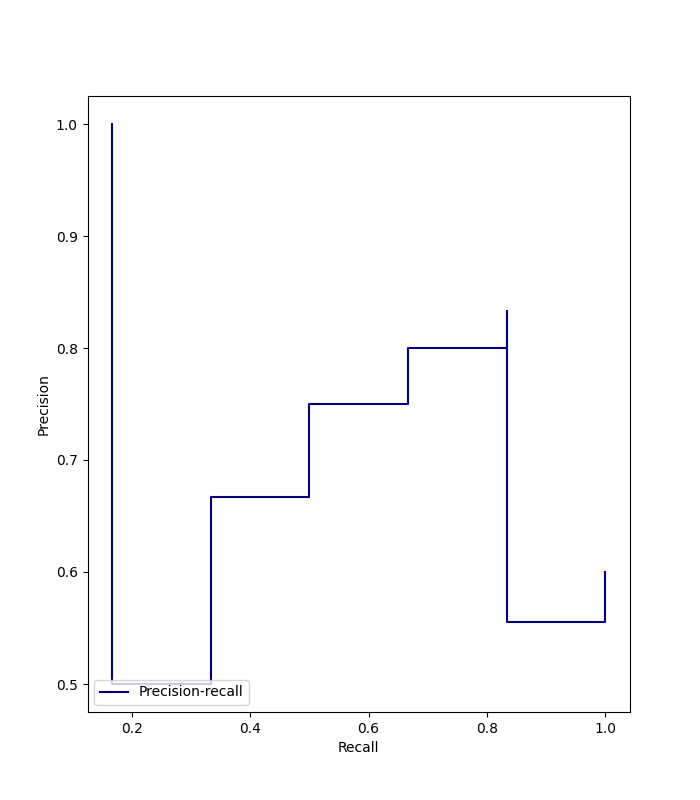
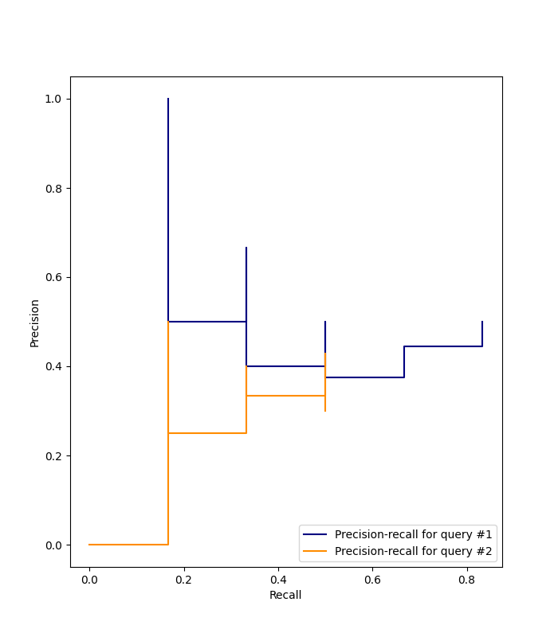

# Information Retrieval Metrics and Plots Computation

A python script that computes common Information Retrieval's metrics and creates a Precision-Recall curve plot for a given set of results.

**Metrics computed by this script:**
- Set of Precision values.
- Set of Recall values.
- Average Precision (AvP).
- Mean Average Precision (MAP).

**Plots:**
- Precision-Recall Curve for a single or multiple query (non-interpolated).


## Table of Contents 
1. [Installation Requirements](#installation)
2. [Usage Examples](#usage)
    1. [How to use?](#how-to)
    2. [Example 1: Single Query](#example1)
    3. [Example 2: Multiple Queries](#example2)

## Installation Requirements <a name="installation"/>

To execute this script from the terminal you should have installed:

- [Python](https://www.python.org/downloads/).
- [Pip](https://pypi.org/project/pip/) that allows to install python's packages.
```
python -m pip install -U pip
```
- [scikit-learn](https://scikit-learn.org/stable/install.html) package.
```
pip install -U scikit-learn
```
- [matplotlib](https://matplotlib.org/stable/users/installing/index.html) package. 
```
python -m pip install -U matplotlib
```

## Usage Examples <a name="usage"/>

### How to use? <a name="how-to"/>

From the terminal, call the script's name passing as arguments:
1. Ordered set of relevant and non-relevant results.
2. Total number of relevant documents on the collection for the information need. 

So,
```
python computeMetrics.py *<orderedSet>* *<totalNumberRelevant>*
```

You can also use this script to evaluate more than one query:
```
python computeMetrics.py *<orderedSet1,orderedSet2,...,orderedSet7>* *<totalNumberRelevant1, totalNumberRelevant2, ..., totalNumberRelevant7>*
```

### Example 1: Single Query <a name="example1"/>

In order to compute the metrics for a single query, run on the terminal:

```
python computeMetrics.py RNRRRRNNNR 6
```

The script prints as result:

```
SET: RNRRRRNNNR

PRECISION: [1.0, 0.5, 0.6666666666666666, 0.75, 0.8, 0.8333333333333334, 0.7142857142857143, 0.625, 0.5555555555555556, 0.6]

RECALL: [0.16666666666666666, 0.16666666666666666, 0.3333333333333333, 0.5, 0.6666666666666666, 0.8333333333333334, 0.8333333333333334, 0.8333333333333334, 0.8333333333333334, 1.0]

AVERAGE PRECISION: 0.7749999999999999

MAP: 0.7749999999999999
```

And creates the Precision-Recall curve plot:



### Example 2: Multiple Queries <a name="example2"/>

In order to compute the metrics for multiple queries, run on the terminal:

```
python3 computeMetrics.py RNRNNRNNRR,NRNNRNRNNN 6,6
```

The script prints as result:

```
SET: RNRNNRNNRR

PRECISION: [1.0, 0.5, 0.6666666666666666, 0.5, 0.4, 0.5, 0.42857142857142855, 0.375, 0.4444444444444444, 0.5]

RECALL: [0.16666666666666666, 0.16666666666666666, 0.3333333333333333, 0.3333333333333333, 0.3333333333333333, 0.5, 0.5, 0.5, 0.6666666666666666, 0.8333333333333334]

AVERAGE PRECISION: 0.6222222222222221


SET: NRNNRNRNNN

PRECISION: [0.0, 0.5, 0.3333333333333333, 0.25, 0.4, 0.3333333333333333, 0.42857142857142855, 0.375, 0.3333333333333333, 0.3]

RECALL:[0.0, 0.16666666666666666, 0.16666666666666666, 0.16666666666666666, 0.3333333333333333, 0.3333333333333333, 0.5, 0.5, 0.5, 0.5]

AVERAGE PRECISION: 0.44285714285714284

MAP: 0.5325396825396824
```

And creates the Precision-Recall curve plot:
